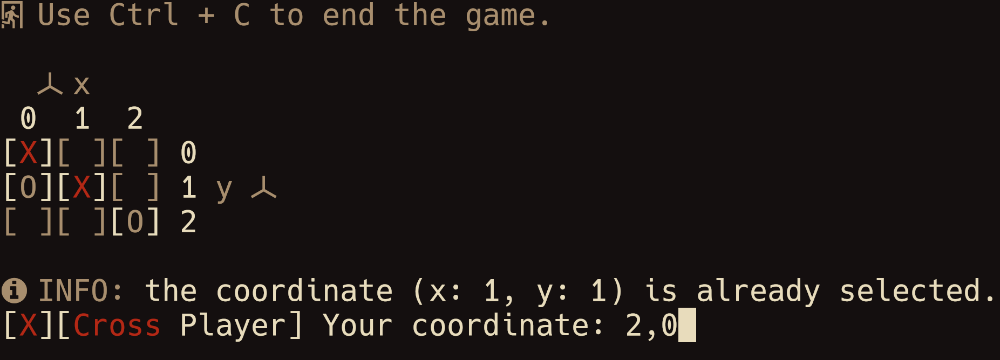

# TicTacToe
## About
This repository contains the source code of TicTacToe, a cross-platform
terminal based tic-tac-toe game written in Java that you can play alone or with
a friend.

Here is a preview that you can check it out:

> [!NOTE]
> The colors used in this game will depend on your terminal emulator's theme. So
> they may look different from the preview in your setup.
>
> For same results, use the same theme: [Flamerial](https://github.com/skippyr/flamerial).
> The font used is [Hack](https://github.com/source-foundry/Hack).




## Installation
### Running A Release
If you just plan to use this software, running it from a release is the way the
go.

#### Dependencies
In order to run the latest release of this software, the following dependencies
must be installed:

- `JRE` (Java Runtime Enviroment): it will be used to run the software.
- A font patched by the [Nerd Fonts](https://www.nerdfonts.com/font-downloads)
  project: it provides the pretty symbols used in the game.

#### Procedures

- Access its [latest release](https://github.com/skippyr/tic-tac-toe/releases/latest)
  page.
- Under the *Assets* section, click on the `TicTacToe.jar` file to download it.
- Access your downloads directory using a command-line utility.
- Execute the `TicTacToe.jar` using `java` to start playing it.

> [!IMPORTANT]
> You must execute it from a command-line. As it does not have a GUI, opening it
> by clicking on it when using a file explorer would just start it as a
> background process that you would need to kill using a task manager to avoid
> wasting resources.

```bash
java -jar TicTacToe.jar
```

### Building From Source
If you are a developer and plan to make changes in the source code, building it
from source is the way to go.

#### Dependencies
In order to build it, the following dependencies must be installed:

- `git`: it will be used to clone this repository.
- `JDK` (Java Development Kit) and `python3`: they will be used to build the
  source code.
- A font patched by the [Nerd Fonts](https://www.nerdfonts.com/font-downloads)
  project: it provides the pretty symbols used in the game.

#### Procedures
- Clone this repository using `git`.

```bash
git clone --depth 1 https://github.com/skippyr/tic-tac-toe
```

- Access the repository's directory.

```bash
cd tic-tac-toe
```

- Run the `build.py` script using `python3` to build the source code.

> [!IMPORTANT]
> If you are using Windows, you must first ensure that both `java` and `jar`
> binaries are in your system's `PATH` environment variable, otherwise they
> won't be found and the build will fail

```bash
python3 build.py
```

- Access the build directory.

```bash
cd build
```

- Execute the `TicTacToe.jar` using `Java` to start playing it.

```bash
java -jar TicTacToe.jar
```

## Issues And Contributions
You can use its [issues page](https://github.com/skippyr/tic-tac-toe/issues) to
provide your feedback, to report any issue you are facing or to ask for help.

You can also fork it and send pull requests to be reviewed.

All kinds of contributions, from people of any skill level, is always
appreciated.

## Copyright
This software is under the BSD-3-Clause license. A copy of the license is
bundled with the source code.
